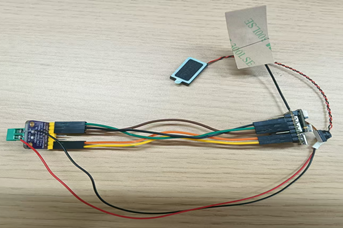

# EasyAI OCR —— 语音交互阅读辅助设备原型

> 🎓 **本科毕业设计项目**
>
> 面向纸质书页阅读场景的语音交互阅读辅助设备原型，融合实时语音识别（ASR）、
> 计算机视觉（CV）、光学字符识别（OCR）与语音合成（TTS），实现页面获取、
> 内容理解、语音播报与页码定位等核心功能。

---

## ✨ 功能概览

| 功能 | 说明 |
|------|------|
| 🎤 **实时语音识别** | 基于达摩院 Paraformer，流式低延迟转写 |
| 🧠 **多模态对话** | 基于 Qwen Omni（通义千问），支持文本 + 图像理解 |
| 🔊 **语音合成** | 本地 TTS 引擎，将 AI 回复转为自然语音播报 |
| 📷 **摄像头采集** | 实时拍摄书籍页面，支持指令触发高清抓拍 |
| 🔍 **页码定位** | 对书说出"找到第42页"，AI 通过视觉引导翻页 |
| 📖 **OCR 全文朗读** | 本地 OCR 提取页面文字，逐段朗读（无需 LLM） |
| 🖥️ **Web 可视化** | 可选后台界面，实时查看识别结果与对话状态 |
| 🛑 **热词打断** | 说出"停下""别说了"即可中断 AI 当前播放 |

---

## 🧩 设备组成

本项目最终形态不是单纯的软件程序，而是一个面向纸质阅读场景的语音交互设备。设备侧负责完成基础控制、任务调度、无线通信和语音播放，上位处理端负责识别、理解与结果生成。当前设备原型实物如图所示：



为便于理解设备组成，主要硬件如下表所示。

| 硬件名称 | 型号/类别 | 主要功能 |
|------|------|------|
| 主控开发板 | Seed Studio XIAO ESP32S3 Sense | 设备控制、任务调度与无线通信 |
| 扬声器 | 方腔1811喇叭 | 输出系统返回的语音结果 |
| 音频功放模块 | I2S MAX98357 | 驱动扬声器完成音频播放 |

从硬件分工来看，主控开发板承担设备侧的核心控制职责，负责协调语音采集、指令传输和状态切换；扬声器与音频功放模块共同完成语音结果输出，使系统能够将识别和理解后的内容以可听方式反馈给用户。这样的硬件组合能够满足当前原型对便携性、实时交互和语音播报的基本要求。

---

## 📂 主要入口程序

本项目当前保留三个主要入口文件，它们并不是面向完全不同产品形态的三套系统，而是围绕同一套阅读辅助原型形成的三种运行方式。

### 1. `app_main.py` — 设备联调与 Web 服务主入口

`app_main.py` 是当前项目中最接近完整设备联调形态的主入口，适合在设备接入、网页展示、状态观察和整体链路验证时使用。

- 基于 FastAPI + WebSocket 提供网页端连接能力
- 接收端侧上传的音频、图像和状态信息
- 负责页面相关任务、页码定位和界面状态同步
- 适合展示完整运行过程和进行联调整体测试

### 2. `main.py` — 本地语音交互调试入口

`main.py` 主要用于本地语音链路和多模态问答链路的快速调试，不依赖完整的设备联调流程，适合在单机环境下验证语音输入、意图判断和语音输出是否正常。

- 统筹本地麦克风、语音识别、问答生成和语音播报
- 支持页码定位相关指令
- 可选启用 Web 可视化界面
- 适合进行本地单机调试和基础功能验证

### 3. `main_ocr.py` — 本地 OCR 阅读调试入口

`main_ocr.py` 在 `main.py` 基础上增加了本地 OCR 识别链路，更适合验证“页面抓拍 - 文字提取 - 语音播报”这一类阅读任务。

- 包含 `main.py` 的基本语音交互能力
- 增加本地 OCR 引擎调用与文本处理流程
- 支持“朗读这一页”这类基于 OCR 的页面阅读任务
- 适合验证本地文字识别和全文朗读效果

三者关系可概括如下：

| 文件 | 主要用途 | 适用阶段 |
|------|------|------|
| `app_main.py` | 设备联调、网页展示、整体链路验证 | 联调与演示 |
| `main.py` | 本地语音交互与问答链路调试 | 单机调试 |
| `main_ocr.py` | 本地 OCR 阅读链路调试 | OCR 功能验证 |

---

## 🚀 环境搭建

默认使用 `requirements.txt` 安装依赖。`environment.design.yml` 作为当前开发环境的 Conda 备份，可在需要时使用。

### 1. 克隆仓库

```bash
git clone git@github.com:cloak-one/EasyAI_OCR.git
cd EasyAI_OCR
```

### 2. 通用安装方式

```bash
python -m venv .venv

source .venv/bin/activate

pip install -r requirements.txt
```

### 3. Windows 安装方式

```bash
python -m venv .venv
.venv\Scripts\activate
python -m pip install --upgrade pip
pip install -r requirements.txt
```

### 4. 说明

- `requirements.txt` 已对 Windows 专属依赖添加平台限制，便于 macOS / Linux 直接安装。
- `torch` 与 `torchvision` 使用通用版本号，若需要 CUDA 版本，请按本机平台改用官方对应安装命令。
- `PyAudio`、`pyttsx3`、`mediapipe`、`pytesseract` 等库在不同操作系统上可能还需要额外的系统级依赖。

### 5. Conda 备选方案

如需直接复用当前开发环境，可使用仓库中的 `environment.design.yml`：

```bash
conda env create -f environment.design.yml
conda activate design
```

### 6. 验证环境

```bash
python --version
pip list
```

当前导出的环境核心版本为：

- Python `3.10.19`
- FastAPI `0.104.1`
- Uvicorn `0.24.0`
- OpenAI SDK `2.23.0`
- DashScope `1.14.1`
- OpenCV `4.8.1.78`
- PyTesseract `0.3.13`
- RapidOCR `1.4.4`

### 7. OCR 额外说明

`environment.design.yml` 已包含 Python 侧 OCR 依赖，例如 `pytesseract` 和 `rapidocr-onnxruntime`。如果使用 Tesseract 路径，还需要额外安装 Tesseract 可执行程序，并确保系统能够正确找到它：

- Windows 安装包可参考：<https://github.com/UB-Mannheim/tesseract/wiki>
- 安装完成后可在命令行执行 `tesseract --version` 验证

### 8. 重新导出环境

如果后续对 `design` 环境中的库版本进行了调整，建议使用下面的命令重新导出并覆盖仓库中的环境文件：

```bash
conda env export -n design --no-builds > environment.design.yml
```

---

## 🔑 API Key 配置

本项目使用阿里云 DashScope 平台的 API，需要配置密钥。

### 1. 获取密钥

访问 [DashScope 控制台](https://dashscope.console.aliyun.com/apiKey) 创建并复制 API Key。

### 2. 配置到项目

在项目根目录的 `.env` 文件中填入密钥：

```bash
# .env 文件（已在 .gitignore 中，不会被上传到 Git）
DASHSCOPE_API_KEY=sk-你的密钥
```

也可参考 `.env.example` 模板文件。

### 3. 验证配置

```bash
python -c "from config import DASHSCOPE_API_KEY; print('密钥加载成功')"
```

> ⚠️ `.env` 文件包含敏感信息，请勿提交到 Git 仓库。

---

## 📖 使用方法

### 启动本地聊天助手

```bash
# 基础聊天模式
python main.py

# 带 OCR 全文朗读
python main_ocr.py

# 启用 Web 可视化面板（浏览器打开 http://127.0.0.1:8765）
python main.py --ui-enable
```

### 启动 WebSocket 服务端

```bash
python app_main.py
```

### 常用参数

```bash
python main.py \
  --camera-index 1 \          # 摄像头索引
  --mic-gain 1.4 \            # 麦克风增益
  --ui-enable \               # 启用 Web UI
  --ui-port 8765 \            # UI 端口
  --asr-debug-raw             # 打印 ASR 调试日志
```

---

## 📁 项目结构

```
EasyAI_OCR/
├── app_main.py              # WebSocket 多客户端服务端
├── main.py                  # 本地聊天助手
├── main_ocr.py              # 本地聊天 + OCR 全文朗读
├── config.py                # 全局配置（从 .env 加载）
├── .env.example             # 环境变量模板
│
├── audio/                   # 音频模块
│   ├── asr_core.py          # ASR 识别核心 + 热词检测
│   ├── omni_client.py       # Qwen Omni 流式客户端
│   ├── tts_core.py          # 本地 TTS 语音合成
│   └── audio_utils.py       # 音频工具函数
│
├── ocr/                     # OCR 模块
│   ├── engine.py            # LocalOCREngine 实现
│   ├── pipeline.py          # OCR 处理流水线
│   └── config.py            # OCR 配置
│
├── image/                   # 图像模块
│   ├── page_finder.py       # 页码定位（LLM 视觉）
│   └── image_recorder.py    # 图像录制
│
├── ui/                      # Web 可视化
│   ├── server.py            # HTTP 服务器
│   ├── publisher.py         # 状态推送
│   └── state_store.py       # 状态存储
│
├── resources/               # 静态资源
│   ├── index.html           # Web 面板
│   ├── static/              # CSS/JS
│   └── voice/               # 语音提示文件
│
└── compile/                 # ESP32 硬件固件
    └── compile.ino          # Arduino 固件
```

## 🔗 参考项目

本项目在原型设计和实现思路整理过程中，参考了开源项目 [AI-FanGe/OpenAIglasses_for_Navigation](https://github.com/AI-FanGe/OpenAIglasses_for_Navigation)。该项目主要面向导航辅助场景，而本项目聚焦于纸质页面阅读辅助，两者在应用目标上并不相同，但其在设备形态、语音交互思路以及端侧与上位处理协同方式上具有一定参考价值。

## 📄 License

本项目为本科毕业设计作品，仅供学习交流使用。
